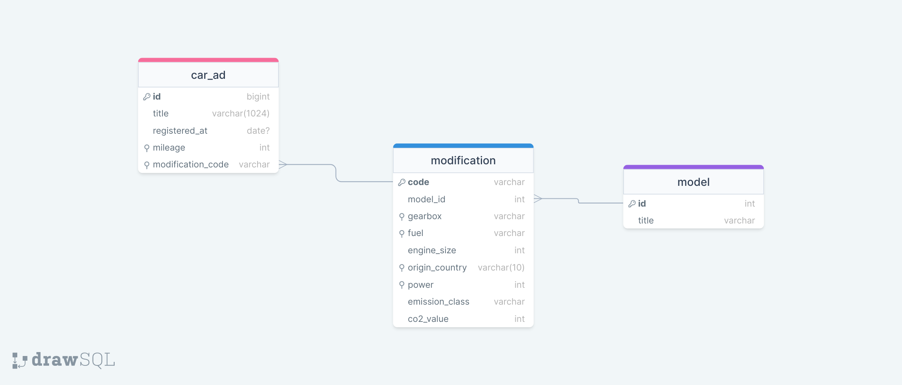

[< Back to Table of Contents](../README.md)

___

## Database schema

Database schema consists of three tables. Starting from the end:
- `model` – contains car brand-models used in the "modification" table. "One-to-many" relationship
- `modification` – contains car configurations with a set of fields that define the uniqueness of the car model configuration.
This table is used to link with the ad-table through a "one-to-many" relationship
- `car_ad` – the advertisement table itself. Only fields unique for ads are used 

If IDE was configured to connect to the project database before, you can further explore the schema in the database manager

### About indexes
Only the indexes necessary for the task were used in the project. The examinee understands that additional indexes
may be required for some queries in a real project

### About other system components

#### Strategy

For diversity in the report generation service `\App\Service\ReportService`, the "Strategy" pattern was used.
Pattern elements can be found here `var/www/src/Strategy/Report`

___

[< Back to Table of Contents](../README.md)
